# HW1: Prompt Pairs

## Before You Start: Setup (Required)

Your runs must be comparable and shareable:

1. **Use regular chats**, outside any Project. Don't use incognito chats: they aren't saved to your history and can't be reopened once closed, and in the new Claude experience they can't run code.
2. **Isolate each run.** In Settings, pause memory, turn off chat search/reference, and clear any profile preferences or custom styles, so earlier chats don't leak into your runs. Turn them back on when you're done.
3. **Hold the setup constant.** Record your plan, model, effort level, and thinking setting. On the newest models thinking can't be turned off; record it as "always on". Keep all of these the same for every run.
4. **Paste inputs into the prompt;** don't attach files. Shared links don't include attachments.
5. **Pace yourself.** Usage limits vary by plan (on Pro they reset every five hours, plus a weekly limit), so spread your runs over at least two days.

---

## Task

Create three prompt pairs, one for each task type below. You choose the concrete task. Ideally, take it from your Project 1.

| # | Task type | Example (don't copy; pick your own) |
|---|---|---|
| 1 | **Generate** — code or a UI component | A form component with validation for your P1 |
| 2 | **Extract** — messy text → structured output | Turn a course syllabus into a list of deadlines |
| 3 | **Critique** — review something and find problems | Review a piece of code or your P1 PRD. Plant 3-4 known defects in it first, so your checklist can include "finds defect X" |

### For each pair

1. **Bad prompt.** This must be realistic: something you'd actually type, or a prompt taken from your own chat history. Straw men ("make an app") lose points.

2. **Checklist**, written BEFORE you run anything. Write 4-6 pass/fail items that define a good result.
   - At least half must check correctness or judgment, not format. Good examples: "invents no dates", "finds the planted off-by-one", "rejects an empty email".
   - Avoid items that only reward the better prompt for echoing its own wording. Example: if only your better prompt asks for JSON, "outputs JSON" is a rigged item.
   - The checklist is frozen once you've seen any output.

3. **Better prompt.** Improve the bad prompt. In 2-4 sentences, explain why it should win: name the principle and link to where Anthropic's guide describes it.

4. **Prediction.** Before running, write down the average score you expect for each prompt.

5. **Evidence.** Run each prompt 3 times, each in a fresh chat. Score every run and share every chat link.

   | Prompt | Run 1 | Run 2 | Run 3 | Average |
   |--------|-------|-------|-------|---------|
   | Bad    | 2/6   | 3/6   | 2/6   | 2.3/6   |
   | Better | 6/6   | 5/6   | 6/6   | 5.7/6   |

   Also report how many runs passed each checklist item. That shows which failures the better prompt fixed.

6. **Error analysis.**
   - Quote one failing passage from a bad-prompt run and one from a better-prompt run.
   - Name each failure's category (e.g., missing context, taken too literally, invented facts, ignored a constraint, too verbose).
   - Did any failure slip past your checklist? Name one item you now wish you'd included. You may not add it to your scores.

7. **Verdict.** Was the better prompt actually better? Compare the result to your prediction.

   > With 3 runs, a gap smaller than 1 checklist item is noise. Call it "no clear difference". An honest "no difference" earns more credit than an unsupported "it's better".

---

## Myth Test (in one of your three pairs)

Pick one technique from the "test it yourself" column: "think step by step", "double-check your answer", aggressive CRITICAL/MUST emphasis, or a persona.

1. Add the technique to your better prompt, changing nothing else.
2. Run that version 3 more times against the same checklist.
3. Report whether the technique helped, hurt, or made no clear difference on your model.

Test the phrase, not a visible explanation. Add the words themselves, e.g. "think step by step". Don't ask Claude to write out its reasoning in the answer: on Claude Opus 5.5, Anthropic notes such requests can be declined.

> A negative result earns full credit. What we grade is a fair setup and an honest conclusion.

---

## Deliverables

Submit one PDF or Markdown document to Canvas containing:

> **Chat links:** use public share links. If your account can only share within an organization (Team or Enterprise plans), include full-page screenshots of each run instead.

---

### 1. Setup

**1.1** What model are you using?

> Claude Opus 5.5

**1.2** What effort level and thinking setting?

> I'm using a medium effort level and always on thinking.

**1.3** What is your Claude plan (Free / Pro / Team / Enterprise)?

> I have an enterprise premium seat.

---

### 2. Prompt Pair 1: Generate (code or a UI component)

**2.1** Task description — what are you asking Claude to generate?

> While not yet approved, I plan to use claude to search out internship/job listings that match provided criteria, pulling in up to date relavent results to the to-do column of the kanban, and saving results in local storage once they're moved to in process. The current task I'm giving claude is to create two components, the first being a kanban column, and the next being a kanban entry card. I'll have claude render two columns to verify the kanban card can be moved between columns.

**2.2** Bad prompt:

```
Generate a small react kanban demo with to do and in progress columns, generate dummy data for the card including link to the listing, the job title, company, and location. Avoid ai styling, and include a toggle for what happens in error state, like a failed return of searched jobs. Save cards between reloads.
```

**2.3** Checklist (4-6 pass/fail items, written BEFORE running anything, at least half testing correctness/judgment):

- [ ] All items must be human testable, so build a toggle for error state
- [ ] The generated artifact contains two rendered reusable columns, "to do" and in "process", and a sample card is included.
- [ ] The kanban card contains the job title, company, location, and a link to the listing.
- [ ] Cards can be moved between the two columns.
- [ ] A card's position is retained between reloads.
- [ ] Columns still render if there are no listings or the "fetch" fails.

**2.4** Better prompt:

```
Think and behave as a senior full stack developer, think thouroughly, and use your thinking to ensure you're writing human readable code. 

Generate an artifact of a react kanban demo that includes todo and in progress columns. 

Do not use a cream or off-white background, italic accent words in headlines, numbered "01/02/03" section labels, monospace labels, or pill-shaped buttons. 

A successful demo is judged by the following characteristics, 
- All items must be human testable, so build a toggle for error state
- The generated artifact contains two rendered reusable columns, "to do" and in "process", and a sample card is included.
- The kanban card contains the job title, company, location, and a link to the listing.
- Cards can be moved between the two columns.
- A card's position is retained between reloads.
- Columns still render if there are no listings or the "fetch" fails. 
```

**2.5** Why should the better prompt win? (Name the principle and link to Anthropic's guide)

> Frontend design defaults: https://platform.claude.com/docs/en/build-with-claude/prompt-engineering/prompting-claude-opus-5-5#frontend-design-defaults

> Thinking capabilities: https://platform.claude.com/docs/en/build-with-claude/prompt-engineering/claude-prompting-best-practices#leverage-thinking-and-interleaved-thinking-capabilities

> Be clear and direct: https://platform.claude.com/docs/en/build-with-claude/prompt-engineering/claude-prompting-best-practices#be-clear-and-direct

**2.6** Prediction — what average score do you expect for each prompt?

- Bad prompt predicted average: 4/6
- Better prompt predicted average: 6/6

**2.7** Score table:

| Prompt | Run 1 | Run 2 | Run 3 | Average |
|--------|-------|-------|-------|---------|
| Bad    | 6/6   | 6/6   | 6/6   | 6/6     |
| Better | 6/6   | 6/6   | 6/6   | 6/6     |

**2.8** Per-item table — how many runs (out of 3) passed each checklist item?

| Checklist item | Bad prompt (x/3) | Better prompt (x/3) |
|----------------|------------------|---------------------|
| All items must be human testable, so build a toggle for error state | 3/3              | 3/3                 |
| The generated artifact contains two rendered reusable columns, "to do" and in "process", and a sample card is included. | 3/3              | 3/3                 |
| The kanban card contains the job title, company, location, and a link to the listing. | 3/3              | 3/3                 |
| Cards can be moved between the two columns. | 3/3              | 3/3                 |
| A card's position is retained between reloads. | 3/3              | 3/3                 |
| Columns still render if there are no listings or the "fetch" fails. | 3/3              | 3/3                 |

**2.9** Chat links:

- Bad Run 1: https://claude.ai/artifact/PvGa7vZ8gPcZMJNtd1S7j5
    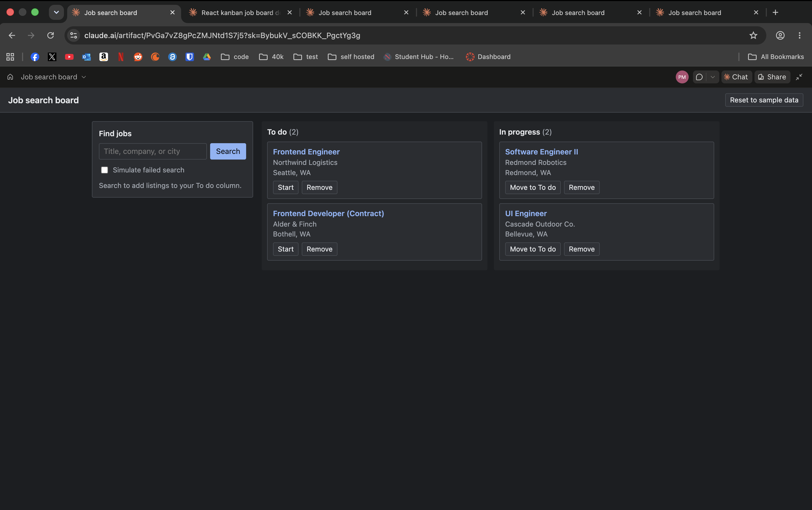
- Bad Run 2: https://claude.ai/artifact/DHco2JyPw6HzCzoRXZihRS
    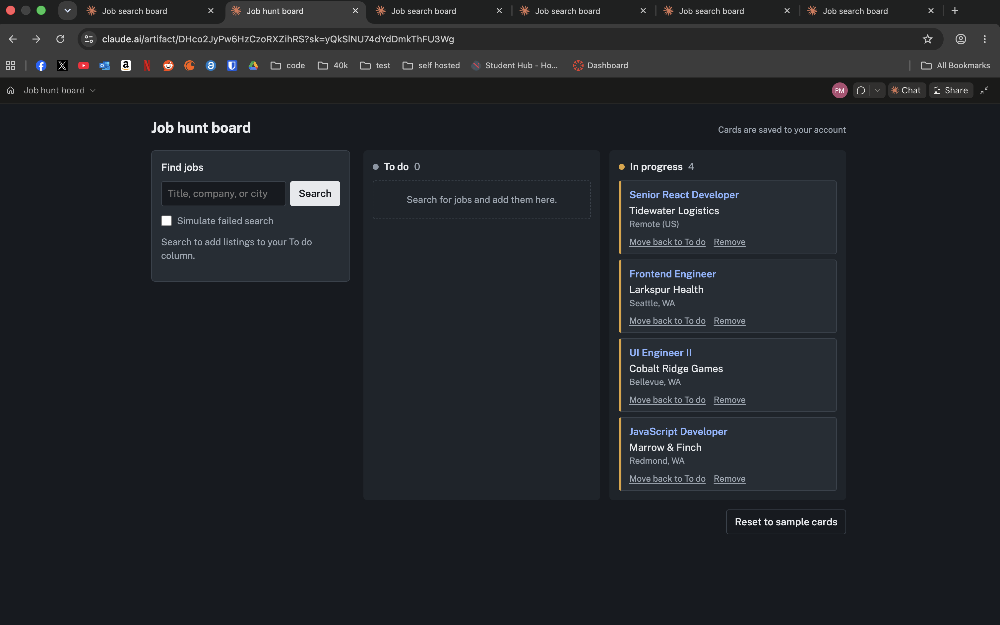
- Bad Run 3: https://claude.ai/artifact/3oy2iqpryMCg4U5CMop9pe
    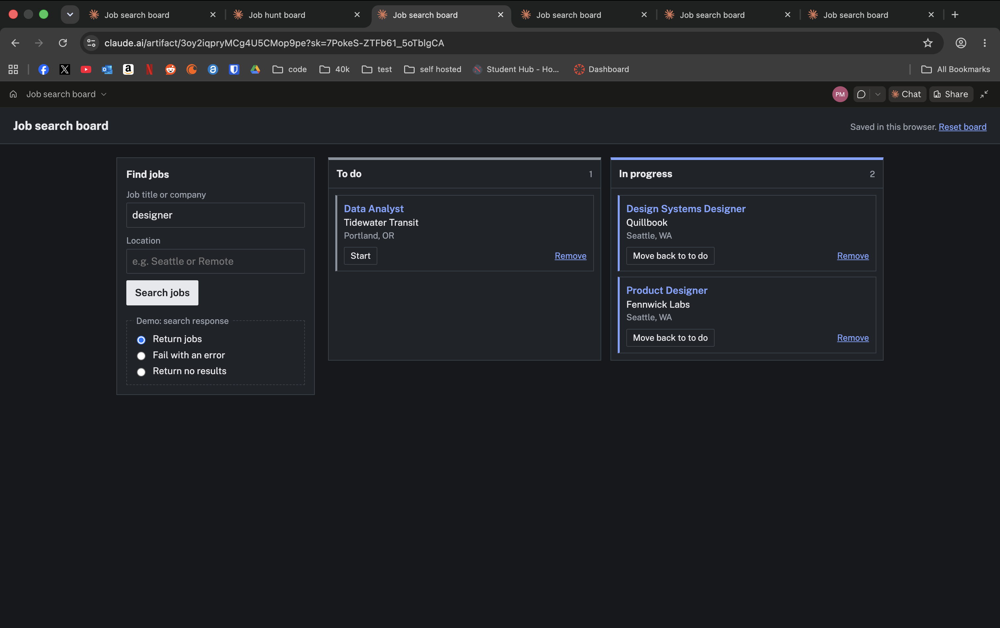
- Better Run 1: https://claude.ai/artifact/5H8sqNNN7c6A2PfXTR7zJF
    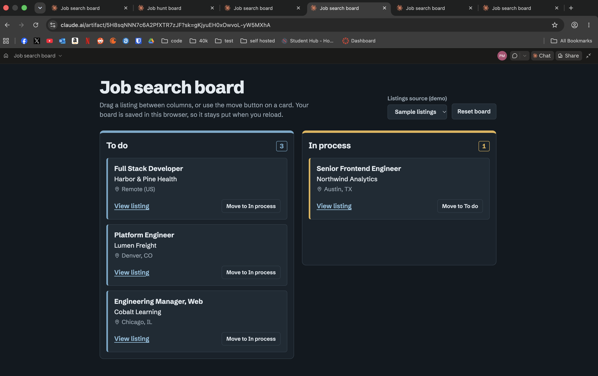
- Better Run 2: https://claude.ai/artifact/1gAFJKhujBwt1PTVdCuN6V
    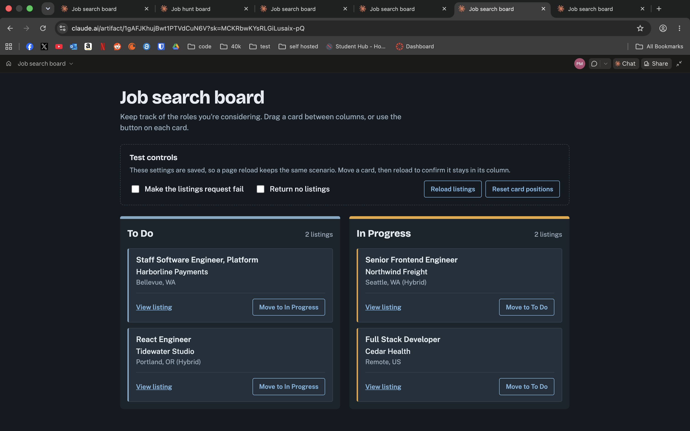
- Better Run 3: https://claude.ai/artifact/A5niph9wA4m86Ktkyo4ZHo
    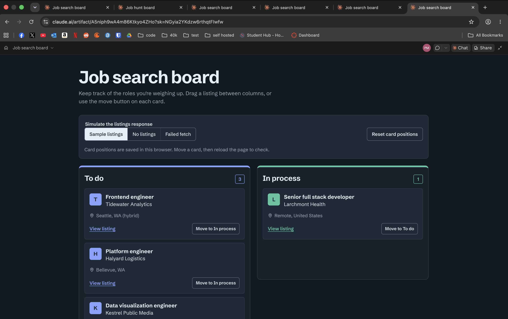

**2.10** Error analysis — quote one failing passage from a bad-prompt run and one from a better-prompt run. Name each failure's category.

> Bad prompt failure (category: n/a):
> I don't see any failures in regards to the rubric, however the bad prompt is styled significantly worse.


> Better prompt failure (category: n/a):
> I don't see any failures in these runs in the context of the rubric.
>

**2.11** Did any failure slip past your checklist? Name one item you wish you'd included.

> I wish I'd included something measureable for styling, potentially a style guide for it to adhere to. Both prompts, even while following prompting guidance, have an ai "smell" on them that neither the suggested prompting nor the "avoid ai" styling was able to get rid of.

**2.12** Verdict — was the better prompt actually better? How does this compare to your prediction?

> The "better prompt" didn't seem better in the context of the rubric, but it did end up creating a more aesthetically pleasing artifact. While there are a ton of factors involved, I think a stronger more targeted rubric could show a larger difference between the two. Specifically, the "bad" runs built artifacts that did attempt to avoid standard AI styling, but it gives itself away via dark mode; that being said it did rely on an older very simple square style of site, something like craigslist, or the github projects kanban. I think my instructions in the bad prompt were too direct to be poorly understood, as even though it wasn't an explicit detailed list, I built a prompt that gave it the tools needed to meet each item in the prompt. Explicitly providing the list of success criteria didn't help much in the output (outside of styling), but it did make it easier to write and compare against output. 

---

### 3. Prompt Pair 2: Extract (messy text → structured output)

**3.1** Task description — what are you asking Claude to extract, and from what?

> I'm asking claude to extract job postings as json from the hacker news "who's hiring" thread. It's forum/reddit style and incluudes user responses/comments, the october thread can be found here: https://news.ycombinator.com/item?id=49922569, but the text provided to the llm is a smaller subset in [hacker_news_sample_data.md](./hacker_news_sample_data.md). It's a messy copy paste including forum ui elements, reply buttons, comments, etc.

**3.2** Bad prompt:

```
Extract the job listings from this forum copy/paste and give them to me in json so an app can consume it. Make it an artifact. [Data set is copy/pasted here, leaving out of document for readability]
```

**3.3** Checklist (4-6 pass/fail items, written BEFORE running anything, at least half testing correctness/judgment):

- [ ] Only job postings in the thread are returned in json, non-job listing replies are ignored. Returned json must not include ui/forum elements, only job information.
- [ ] Returned json is accurate to the information listed in the job posting including title, company, location outside link if included in posting. Additional role information is not included.
- [ ] No hallucinated roles are included
- [ ] Missing information is listed as "null" not skipped.

**3.4** Better prompt:

```
[Data set is copy/pasted here, leaving out of document for readability]

Sort the pasted thread above into a list of posted jobs, return the list as json including title, company, location, and a link to the role if included, use these keys:
    {   
        "title": string/null,
        "company": string/null,
        "location": string/null,
        "link": string/null
    }

 List missing information as null and do not skip it. 

Do not include any content from non-top level replies unless it's an additional job listing.

```

**3.5** Why should the better prompt win? (Name the principle and link to Anthropic's guide)

> This better prompt should win for two major reasons, it uses an explicit json example, and is also significantly more direct in regards to what information the returned json should return.

> https://platform.claude.com/docs/en/build-with-claude/prompt-engineering/claude-prompting-best-practices#use-examples-effectively
> https://platform.claude.com/docs/en/build-with-claude/prompt-engineering/claude-prompting-best-practices#be-clear-and-direct

**3.6** Prediction — what average score do you expect for each prompt?

- Bad prompt predicted average: 3/4
- Better prompt predicted average: 4/4

**3.7** Score table:

| Prompt | Run 1 | Run 2 | Run 3 | Average |
|--------|-------|-------|-------|---------|
| Bad    | 1/4   | 0/4   | 1/4   | 0.67/4  |
| Better | 4/4   | 4/4   | 4/4   | 4/4     |

**3.8** Per-item table — how many runs (out of 3) passed each checklist item?

| Checklist item | Bad prompt (x/3) | Better prompt (x/3) |
|----------------|------------------|---------------------|
| Only job postings in the thread are returned in json, non-job listing replies are ignored. Returned json must not include ui/forum elements, only job information. |       0/3           |        3/3             |
| Returned json is accurate to the information listed in the job posting including title, company, location outside link if included in posting. Additional role information is not included. |                0/3  | 3/3                    |
| No hallucinated roles are included |              0/3    |            3/3         |
| Missing information is listed as "null" not skipped. |          2/3        |             3/3        |

**3.9** Chat links:

- Bad Run 1: https://claude.ai/artifacts/latest/f09731de-b789-4e32-9670-45eb93bacaff
    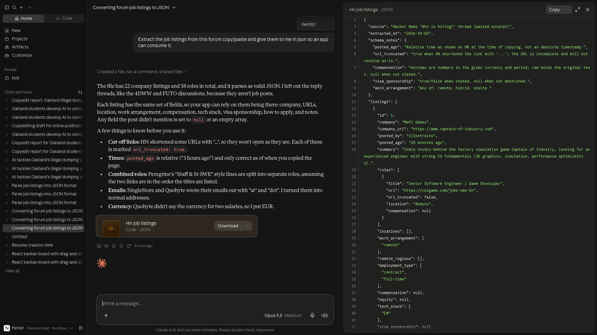
- Bad Run 2: https://claude.ai/artifacts/latest/94f8d116-1022-4c7d-9050-705e231d3cef
    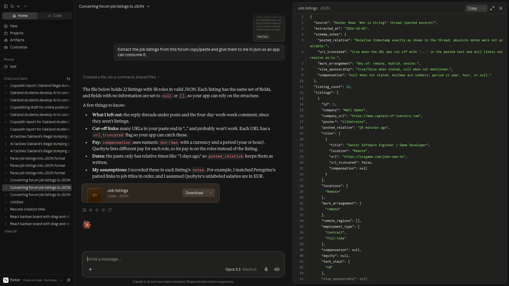
- Bad Run 3: https://claude.ai/artifacts/latest/fa4ac4b4-014a-48a8-85f7-2fe1a6cfa790
    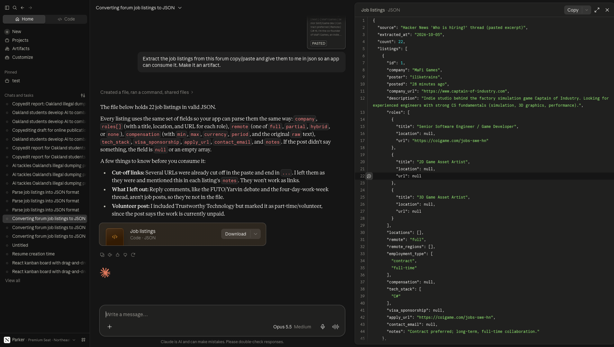
- Better Run 1: https://claude.ai/share/a99f0108-4e36-44fd-867d-3a0d97b2110b
    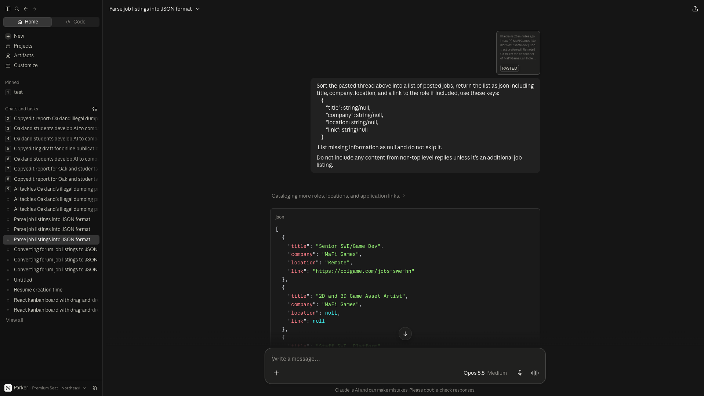
- Better Run 2: https://claude.ai/share/88f38eda-085e-4a18-9dff-f7062de65c2f
    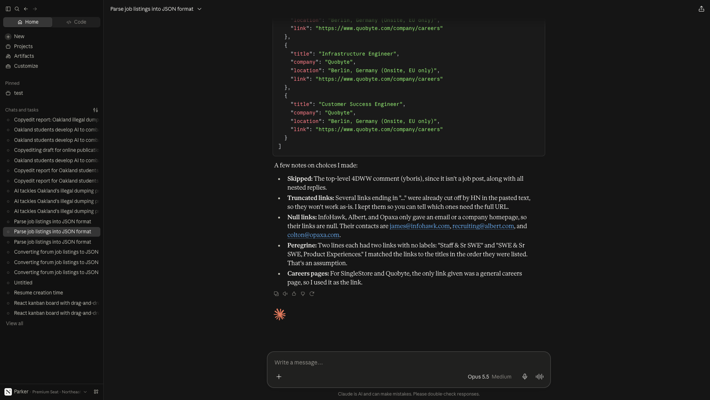
- Better Run 3: https://claude.ai/share/972ffa87-4375-4e8e-8c04-f3b9ba664027
    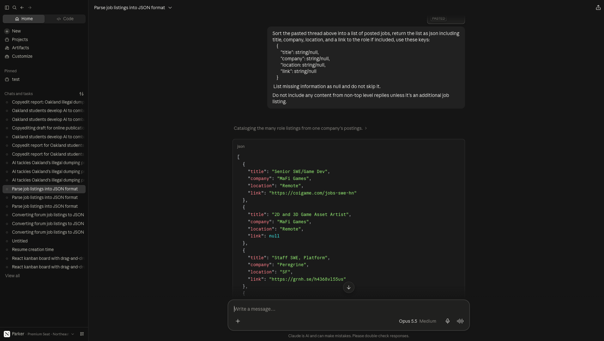

**3.10** Error analysis — quote one failing passage from a bad-prompt run and one from a better-prompt run. Name each failure's category.

> Bad prompt failure (category: Major formatting failure, additional unrequested info is included):
>
> ```json
> {
>       "id": 1,
>       "company": "MaFi Games",
>       "poster": "iliketrains",
>       "posted": "28 minutes ago",
>       "company_url": "https://www.captain-of-industry.com",
>       "description": "Indie studio behind the factory simulation game Captain of Industry...",
>       "roles": [
>         {
>           "title": "Senior Software Engineer / Game Developer",
>           "location": null,
>           "url": "https://coigame.com/jobs-swe-hn"
>         },
>         {
>           "title": "2D Game Asset Artist",
>           "location": null,
>           "url": null
>         }
>       ],
>       "locations": [],
>       "remote": "full",
>       "remote_regions": [],
>       "employment_type": ["contract", "full-time"],
>       "compensation": null,
>       "tech_stack": ["C#"],
>       "visa_sponsorship": null,
>       "apply_url": "https://coigame.com/jobs-swe-hn",
>       "contact_email": null,
>       "notes": "Contract preferred; long-term, full-time collaboration."
> }
> ```

> Better prompt failure (category: n/a ):
> The better prompt is much more specific regarding the requested output, based on the more detailed prompt, I haven't been able to find any mismatches with the requested format or included information.
>

**3.11** Did any failure slip past your checklist? Name one item you wish you'd included.

> I wish I'd included further grading on the structure of the returned object, not just the included keys, as the poor run returned a deeply nested group of objects which would be annoying to work with. I much preferred the flat structure returned by the better prompt, as it's much easier to have an app consume.

**3.12** Verdict — was the better prompt actually better? How does this compare to your prediction?

> The results line up well with my prediction, with the better prompt returning a much cleaner and more accurate group of objects.

---

### 4. Prompt Pair 3: Critique (review something and find problems)

**4.1** Task description — what are you asking Claude to critique? What defects did you plant?

> I've taken the following article from neu news: https://news.northeastern.edu/2026/10/05/oakland-illegal-dumping-prevention/ and have added several typos and logical inconsistencies. I'll be posing as an article writer asking claude for help fixing the issues and asking for an error report

**4.2** Bad prompt:

```
Can you please read this article I'm writing and edit for spelling, logical inconsistencies, etc.

[Pasted article content here]
```

**4.3** Checklist (4-6 pass/fail items, written BEFORE running anything, at least half testing correctness/judgment):

- [ ] All four typos are caught and raised: divrese, stationery, itterations, highest-frequncy
- [ ] Claude catches that five students are named, but later the article refers a four person team.
- [ ] Claude catches Pranav Kishore's last name is changed to Guerra
- [ ] Claude catches Camera footage is unavailable, but later the dashboard section claims to use live fotage from that camera footage.
- [ ] Claude provides an error summary/report at the end of the response.

**4.4** Better prompt:

```
I am preparing the below draft to be published online. Review this draft, copyediting and checking for internal consistency.

Be sure to check for: Spelling and incorrect words, inconsistency in names, numbers, count, and general logic, any contradiction, and other errors that can be determined from reading the draft.

Once complete, provide a full error/report and summary.
[Pasted content here]
```

**4.5** Why should the better prompt win? (Name the principle and link to Anthropic's guide)

>The prompt follows “Add context to improve performance” (https://platform.claude.com/docs/en/build-with-claude/prompt-engineering/claude-prompting-best-practices#add-context-to-improve-performance) by explaining that the draft is being reviewed before publication, and by being direct, providing specifics for error targeting.

**4.6** Prediction — what average score do you expect for each prompt?

- Bad prompt predicted average: 2/5
- Better prompt predicted average: 4/5

**4.7** Score table:

| Prompt | Run 1 | Run 2 | Run 3 | Average |
|--------|-------|-------|-------|---------|
| Bad    | 4/5   | 4/5   | 4/5   | 4/5   |
| Better | 5/5   | 5/5   | 5/5   | 5/5   |

**4.8** Per-item table — how many runs (out of 3) passed each checklist item?

| Checklist item | Bad prompt (x/3) | Better prompt (x/3) |
|----------------|------------------|---------------------|
| All four typos are caught and raised: divrese, stationery, itterations, highest-frequncy | 3/3 | 3/3 |
| Claude catches that five students are named, but later the article refers a four person team. | 3/3 | 3/3 |
| Claude catches Pranav Kishore's last name is changed to Guerra | 3/3 | 3/3 |
| Claude catches Camera footage is unavailable, but later the dashboard section claims to use live fotage from that camera footage. | 3/3 | 3/3 |
| Claude provides an error summary/report at the end of the response. | 0/3 | 3/3 |

**4.9** Chat links:

- Bad Run 1: https://claude.ai/share/1d862cec-f13c-4e17-b56a-de5621d7ce89
    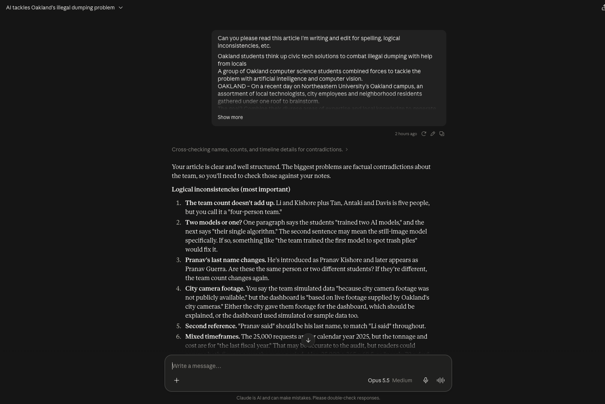
- Bad Run 2: https://claude.ai/share/5fbedcc0-cb7e-4bac-ae18-104f1dd6f65d
    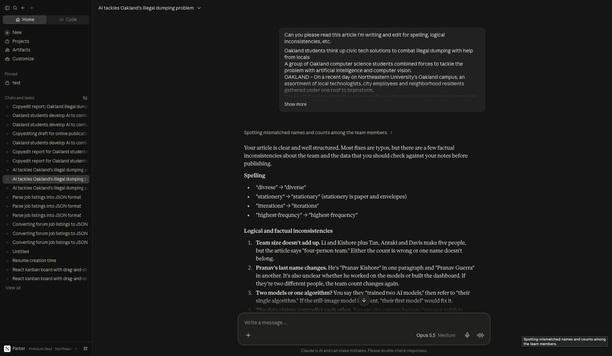
- Bad Run 3: https://claude.ai/share/a5fe5226-28d0-4352-ad1c-1d53221d1fd9
    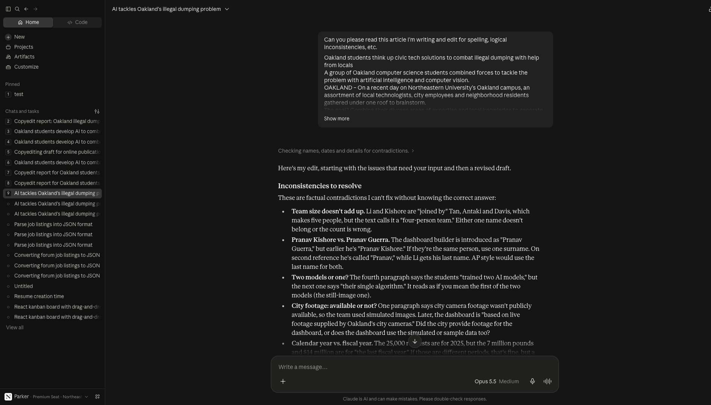
- Better Run 1: https://claude.ai/share/6928a2f4-3790-4493-9f2d-9302491b5599
    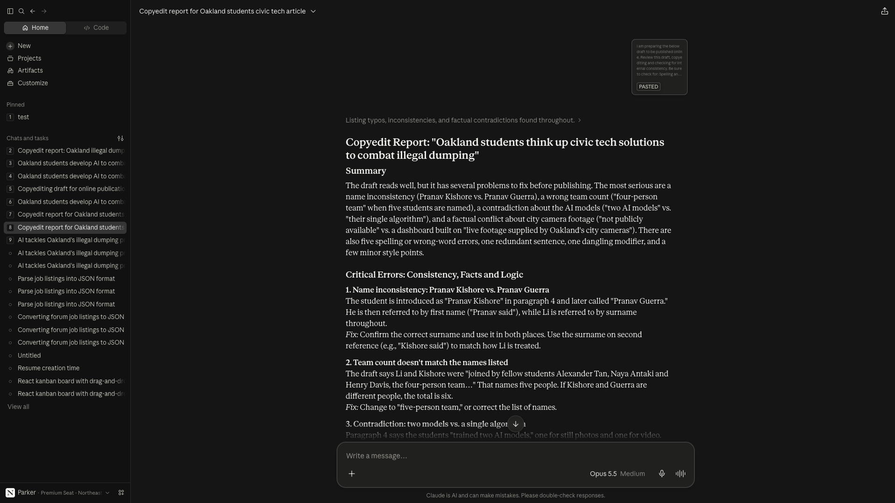
- Better Run 2: https://claude.ai/share/ea18bb7f-e1e1-44b1-bb27-00eaf7512dc9
    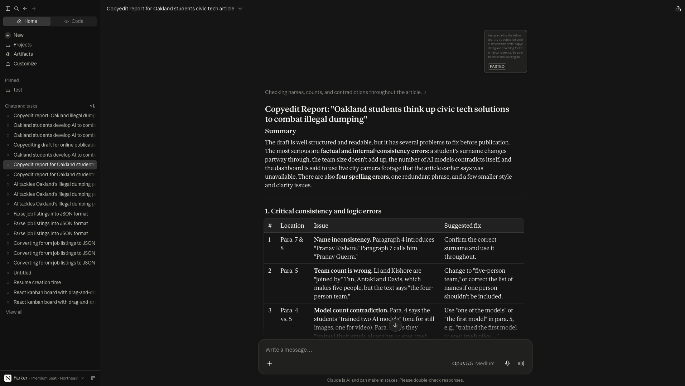
- Better Run 3: https://claude.ai/share/e6386311-fc2b-4622-86ec-2397b52b3125
    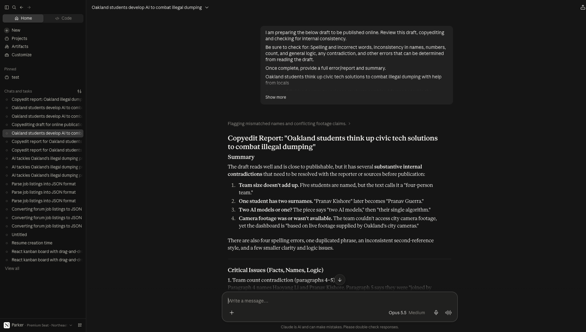

**4.10** Error analysis — quote one failing passage from a bad-prompt run and one from a better-prompt run. Name each failure's category.

> Bad prompt failure (category: End of article, no summary/report ):
>
> At the recent idea-a-thon, part of a weeklong series of Oakland Tech Week programming on campus, Northeastern partnered with the all-volunteer civic tech nonprofit OpenOakland to continue the conversation, collecting input from the area residents most affected by illegal dumping.
>
> I also made a few small changes in the draft: "a human's arm" became "a person's arm," "impacted" became "affected," and I added "the" before OpenOakland. You can keep or drop any of those.

> Better prompt failure (category: n/a ):
> The better runs didn't appear to have any failures, and provided the report, and caught all typos and inconsistencies listed.


**4.11** Did any failure slip past your checklist? Name one item you wish you'd included.

> Something that surprised me in these responses was the model's attempt to "correct" style. If I had to do it again, I'd provide multiple samples of writing from the same author as context, that way stylistic voice wouldn't be heavily policed as it is now. It appears to favor a more technical style of writing that seems less natural. I was able to see this as the responses to the article in the bad prompts didnt provide a report, instead, re-writing the article itself. I'd have created an item where style isn't heavily policed, but this is a chanllenging metric as it isn't fully objective.

**4.12** Verdict — was the better prompt actually better? How does this compare to your prediction?

> The better prompt is better, as it provided an output in the format I wanted, and it was much more usable, as I wouldn't have to review the article line by line to see where changes are made. That being said, the difference between the two prompts is much smaller than I expected, I didn't think the worse prompt would have enough direction to pick out the included inconsistencies.

---

### 5. Myth Test

**5.1** Which pair did you apply the myth test to? (Pair 1, 2, or 3)

> I applied the myth test to pair 3, while it's a bit challenging to verify as it scored perfect "objectively" there was still something to be desired when it came to targeting stylistic language choices for changes.

**5.2** Which technique did you test? ("think step by step" / "double-check your answer" / aggressive CRITICAL/MUST emphasis / a persona)

> I'm testing the persona technique.

**5.3** What exact text did you add to the better prompt?

> I've included the full prompt below, the new addition to the prompt is the first line.
>
> *You are an editor for public facing online articles for Northeastern University, think and behave this way.*
> I am preparing the below draft to be published online. Review this draft, copyediting and checking for internal consistency.
> Be sure to check for: Spelling and incorrect words, inconsistency in names, numbers, count, and general logic, any contradiction, and other errors that can be determined from reading the draft.
> Once complete, provide a full error/report and summary.

**5.4** Score table (myth test version, 3 runs):

| Prompt | Run 1 | Run 2 | Run 3 | Average |
|--------|-------|-------|-------|---------|
| Better + technique |   5/5    | 5/5      | 5/5      | 5/5        |

(Compare against better prompt average from the pair above)

**5.5** Chat links:

- Myth Run 1: https://claude.ai/share/5b5dd255-fd75-4454-a62b-c376919f27f3
    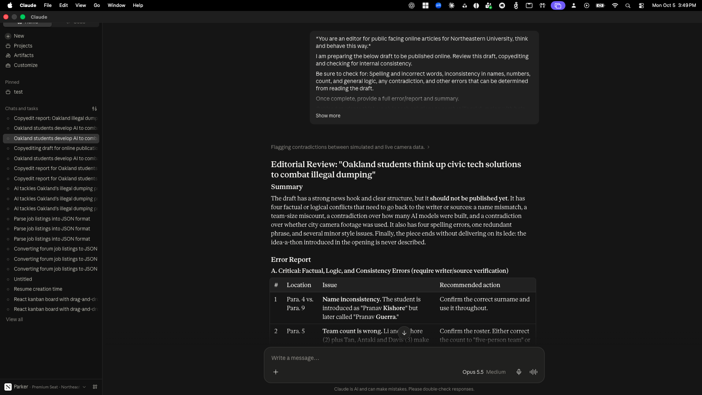
- Myth Run 2: https://claude.ai/share/a747a2e0-936c-45ed-9cc7-faa299cb5085
    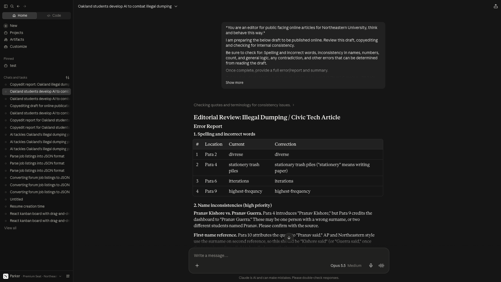
- Myth Run 3: https://claude.ai/share/924c09f5-38e4-40fe-8e9f-3e77f22533bd
    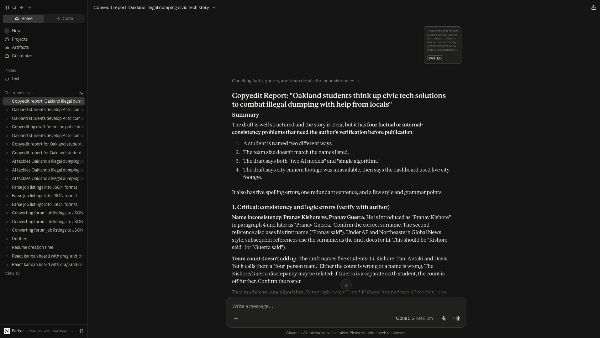

**5.6** Conclusion — did the technique help, hurt, or make no clear difference?

> The persona technique didn't make a measureable difference as all "better" runs have met all the rubric criteria. That being said, the technique did have an effect on the response. Outside of the issue report, the model did attempt to behave as an editor would. Instead of only providing the report, it did include full redrafts for all responses. 

---

### 6. Reflection (~300 words)

> I feel like my response to this questioned is tempered by my ability to create the rubrics. I think I was too lax with my requirements, or wrote too strong of prompts for my "bad" prompts. It was a challenge to determine what had "improved" responses as my rubric was not prepared for those. That being said, directness and specificity appear to be the major factors in improving prompt output. I feel I understand the advice of treating claude like an enthusiastic new employee, it can do work with minimal instructions, but there will be issues with output whether that's in regard to output code, or natural language targeting of "problems" that don't exist (such as writing style) as seen here, "I also changed ‘age-old’ to ‘long-standing’ and dropped ‘Using the campus as a forum’ because it repeated the opening paragraph. Feel free to revert either.". By explaining the task more throuroughly, providing a self check rubric, and structuring prompts, I was able to pretty consistently improve on the "bad" prompts". I was also surprised the prompt performed as well as they did, especially for the logical inconsistencies in the editing task. That being said, the model also expanded beyond what I asked as seen here, "Here’s my edit, starting with the issues that need your input and then a revised draft.". If I did this assignment again I would change my rubrics to grade staying within scope, as I feel the model wants to overreach, and I was not able to grade that as a failure, as it matched the other requirements.

---

### 7. Personal Prompt Template

**7.1** Write a reusable prompt template you'd actually use for P1. Include a one-line note on each section explaining why it's there.

```
Task: Please create a x that will be used for y
Why: This sentence is here to prime the model for what information will be useful and what the expected output is.

Context: The y will be used for z, a, and b.
Why: Claude docs point to adding additional context in this format to the request so claude can "think" on what information will be relevant.

Requirements:
    - Rubric item A
    - Rubric item B
    - Rubric Item C
Why: This provides specific success conditions and allows claude to self review and correct itself. This also limits claude's scope.

Output: Return the result in x format, if any information is ambigous, ask instead of making choices
Why: This ensures the generated data or artifact are returned in the corrected format. This should include a description of the format, as seen in my testing above where I received flat and nested json output.
```

---